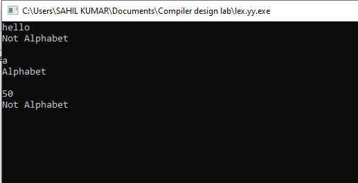
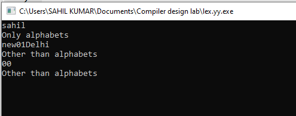
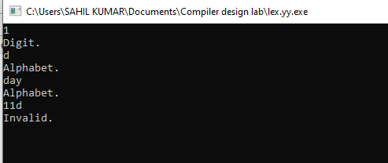
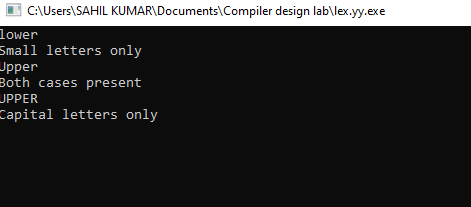

# Output

- ### Problem 2.1

       Write a program to check if the given input is an Alphabet.

  

  ***

- ### Problem 2.2

      Write a program to check if the given input contains only Alphabets.

  

  ***

- ### Problem 2.3

      Write a program to check if the given input is a Digit or an Alphabet.

   

---

- ### Problem 2.4

      Write a program to check if the given input contains only Uppercase letters or Lowercase letters or Digits or Special
      characters or Mixed characters.

   
