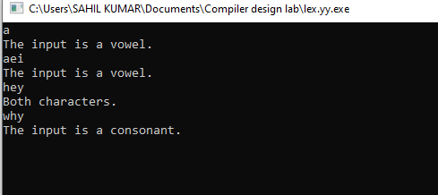
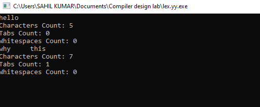
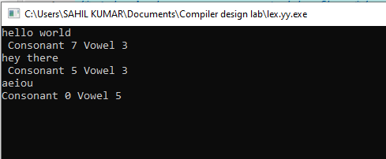

# Output

- ### Problem 3.1

       Write a program to check if the given input is a consonant or a vowel.

  

---

- ### Problem 3.2

      Write a program to count the total number of characters in the input.

   

---

- ### Problem 3.3

      Write a program to count the vowel, consonant, digit and whitespace in the given input.

   
