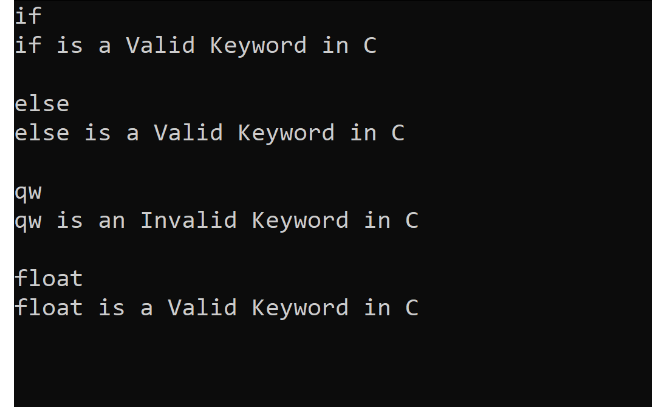
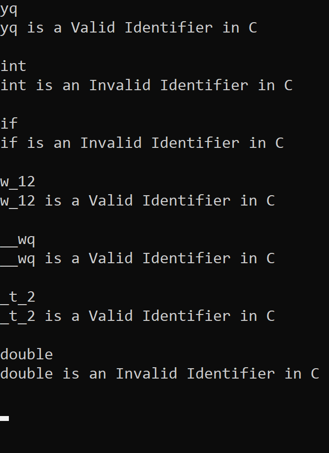
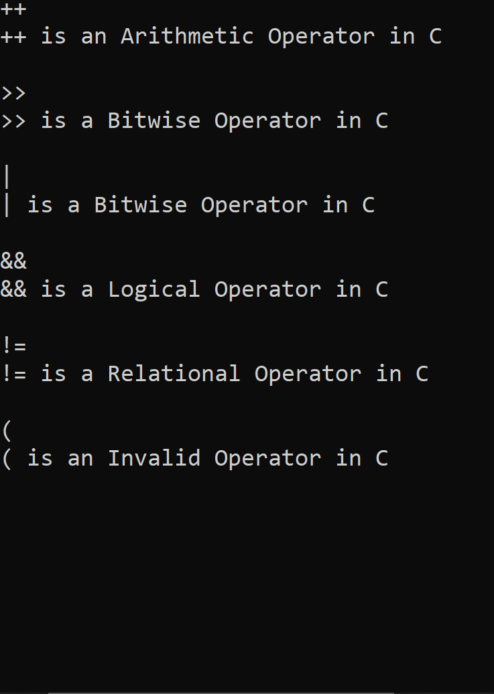
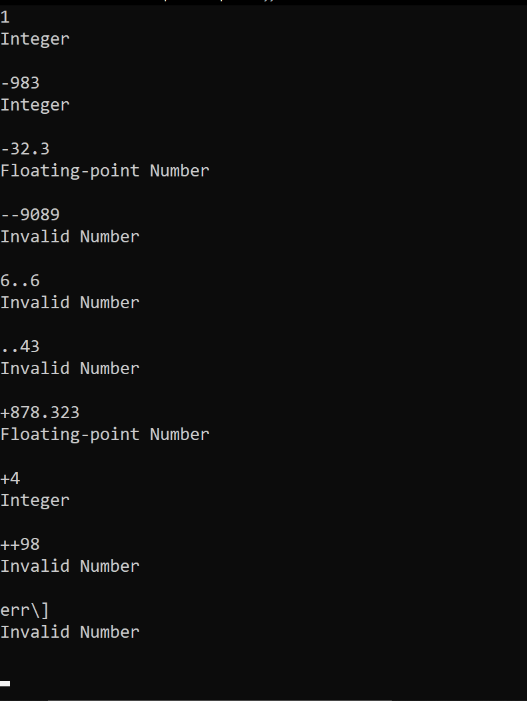

# Output

- ### Problem 4.1

       Write a lex program to check whether the input string is a Valid Keyword in C or not.

  

---

- ### Problem 4.2

      Write a lex program to check whether the input string is a Valid Indentifier in C or not.

   

---

- ### Problem 4.3

      Write a lex program to check whether the input is a Valid Operator in C or not.

   

---

- ### Problem 4.4

      Write a lex program to check whether the input is an Integer or a Floating-point number.

   
