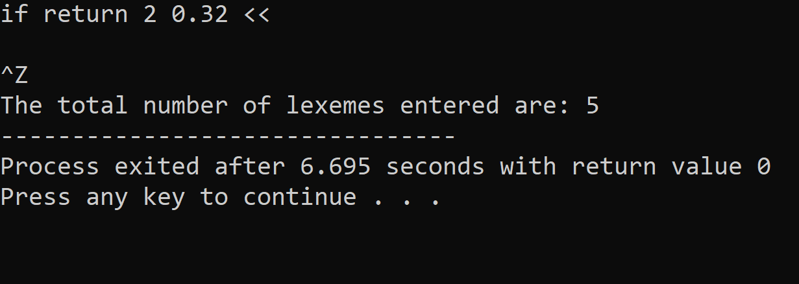
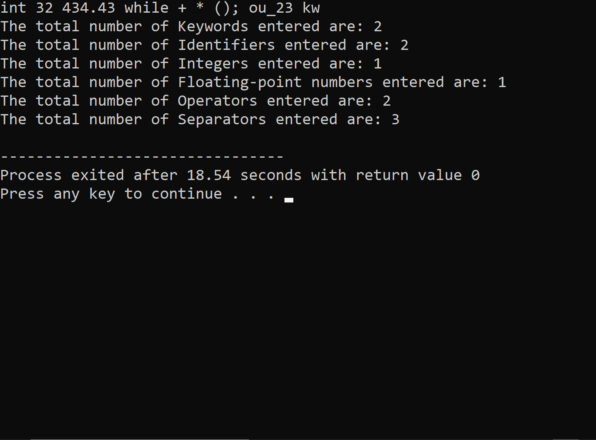
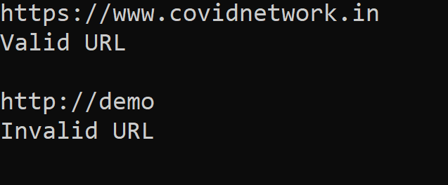

# Output

- ### Problem 5.1

      Write a lex program to count the total number of lexemes.

  

---

- ### Problem 5.2

      Write a lex program to count the number of keywords, identifiers, operators, integers etc.

   

---

- ### Problem 5.3

      Write a lex program to check URL is Valid or Not.

   
