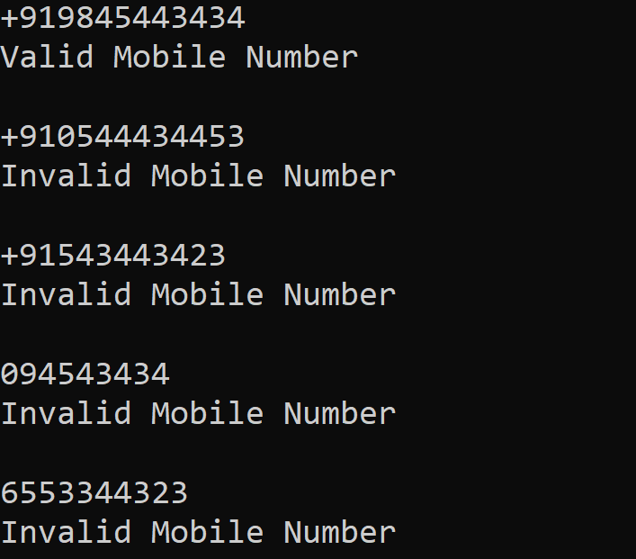
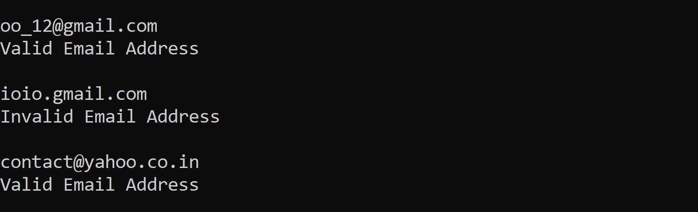
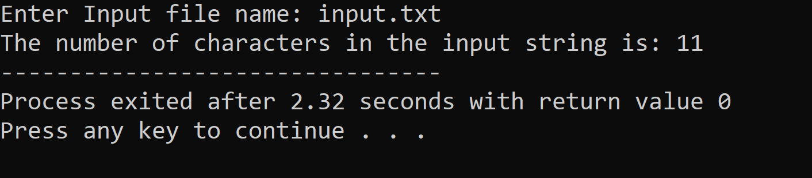

# Output

- ### Problem 6.1

       Write a lex program to check whether the input Mobile Number is Valid or Not.

  

---

- ### Problem 6.2

       Write a lex program to check whether the input string is a Valid Email address or not.

   

---

- ### Problem 6.3

       Write a lex program to count the number of characters in the Input file.

   
