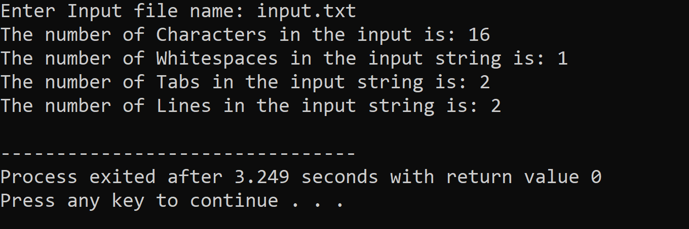

# Output

- ### Problem 7.1

      Write a lex program to count the number of characters, whitespaces, tabs and lines in the Input file.

  

---

- ### Problem 7.2

      Write a lex program to count the number of lexemes in the Input file.

   
   
   ----
* ### Problem 7.3

      Write a lex program to take input from a file and remove multiple whitespace, tab and newline and write output in a separate file.
